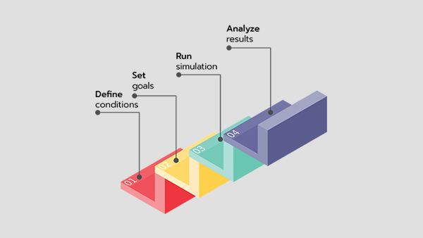

# MicrogridCreator (MgC)

**MicrogridCreator** is a powerful and easy-to-use microgrid simulation and optimization engine. It helps developers and end users plan, design, and optimize complex sector-coupled decentralized energy systems. The final version of **MgC** is a cloud-based service that can run independently of the end-user's device. The MgC tool holds immense potential for designing efficient and resilient microgrid systems, enabling optimized energy management and sustainable power distribution.

### Advantages

1. ### Simple and ease-of-use

<figure><figcaption>
Simple Application
</figcaption></figure>

In 4 steps to your goal:

* Define the framework of your system
* Set the goal of your optimization
* Run the simulation
* Analyze the results

2. **Data visualization & export**

<figure><figcaption>
Comprehensive data visualization features
</figcaption></figure>

The extensive visualization features give you a quick overview of the most important parameters and optimization results.

* Both the technical and the economic key figures can be recorded as time series data and summary overviews.
* Export the data in the format you need for integration into your workflow.

Seeing what matters at a glance saves you a lot of time and effort.

3. **Work flexibility**

<figure><figcaption></figcaption></figure>

Manage your project on any device at any time.

* Start a new project in the office,
* deal with it more closely on the way to your customers,
* and change it when meeting with your project partners.

**MicrogridCreator** 's cloud concept enables you to work together on your projects whenever you want.

4. **Learning & Teaching**

<figure><figcaption></figcaption></figure>

**MicrogridCreator helps you** to better understand how your optimized energy system works. You can use **MicrogridCreator** to:

* learn  more about system design and management in general
* advise your business customers&#x20;
* To teach students in an academic context

**MgC** 's academic background enables it to be widely used in many different contexts.
