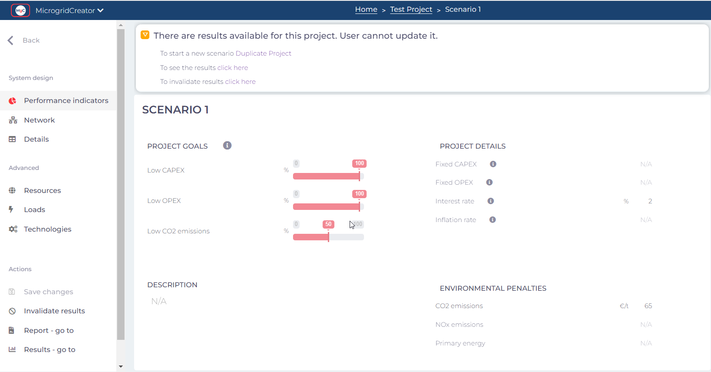
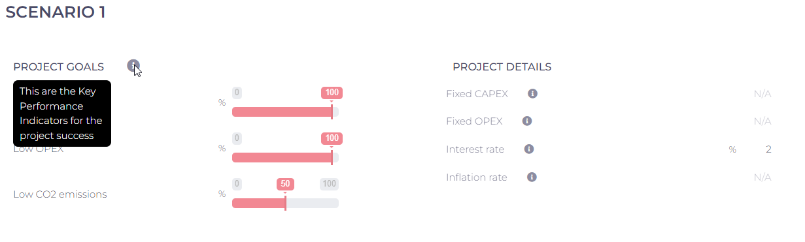

# Key Performance Indicators

KPIs are essential metrics used to assess and measure the success of a microgrid project. They help formal entities and professionals in the world make informed decisions. The key KPIs provided by the MgC include:

<strong>CAPEX (Capital Expenditure)</strong>

Evaluates the initial investment required to establish the microgrid infrastructure, including equipment, installation, and setup costs. Monitoring [CAPEX](../glossary/definitions.md#reference-for-kpi-formulas) is crucial to ensure cost-efficient project development.&#x20;

<strong>OPEX (Operational Expenditure)</strong>

Measures the ongoing operating and maintenance costs of microgrids. Managing [OPEX ](../glossary/definitions.md#reference-for-kpi-formulas)is essential for long-term sustainability.

Emissions

Emissions KPI quantifies the reduction in [greenhouse gas emissions(GHG)](../glossary/definitions.md#reference-for-kpi-formulas) achieved by the microgrid, emphasizing its contribution to environmental sustainability.&#x20;

<strong>Interest rate</strong>

Reflects the cost of financing the microgrid project, impacting its financial feasibility.

Inflation rate

Considers the influence of inflation on operational costs, aiding in financial planning.

Incorporating these KPIs will assist the MgC users in comprehending their importance and how they influence the performance and sustainability of a microgrid project. [**MgC's backend solver** ](../modeling-and-optimization/modeling/modeling-approach.md)empowers its users to shape the microgrid project according to the user's unique sustainability goals. By considering the user's specifications, it calculates emissions, ensuring a customized and environmentally responsible solution.

The performance indicators can be seen after simulating the project under the system design feature in the MgC layout.

<figure><figcaption>
Performance indicators for the project simulation
</figcaption></figure>


To access detailed information about a specific parameter, simply click on the adjacent information button for comprehensive guidance as shown in below.


<figure><figcaption></figcaption></figure>

Explore the KPIs that steer the project towards cost-efficiency, reduced emissions, and optimized production. With MgC, one can put the project in control by providing precise insights into [LCOE (Levelized Cost of Energy)](../glossary/definitions.md#reference-for-kpi-formulas), total energy demand, renewable energy share, total grid exports, project lifetime, and total renewable energy in the microgrid. These turning points empower the users to make data-driven decisions, ensuring a sustainable and efficient energy future for the project.

Other KPIs to consider

* **LCoE (Levelized Cost of Energy):** A lower LCOE enhances project cost-efficiency and profitability.

<!---->

* **Total energy demand:** Accurate demand assessment ensures efficient energy supply without overspending.

<!---->

* **Renewable share:** Higher renewable share reduces emissions and long-term costs, promoting sustainability.

<!---->

* **Total grid export:** Maximizing grid exports boosts potential income and ROI.

<!---->

* **Project lifetime:** Longer project lifetimes lead to better cost amortization and extended benefits.

<!---->

* **Total renewable energy in the Microgrid:** More renewables improve sustainability and reduce environmental impact.

As part of MgC, the system overview showcases post-simulation results, presenting the project's essential KPIs in the report. This feature provides precise and relevant data for assessing and optimizing the system's key parameters, offering valuable insights for informed decision-making and performance evaluation within the microgrid. Utilizing MgC's insights into these factors optimizes project outcomes, promoting efficiency and sustainability.

<figure><figcaption>
Performance indicators after the project simulation
</figcaption></figure>
