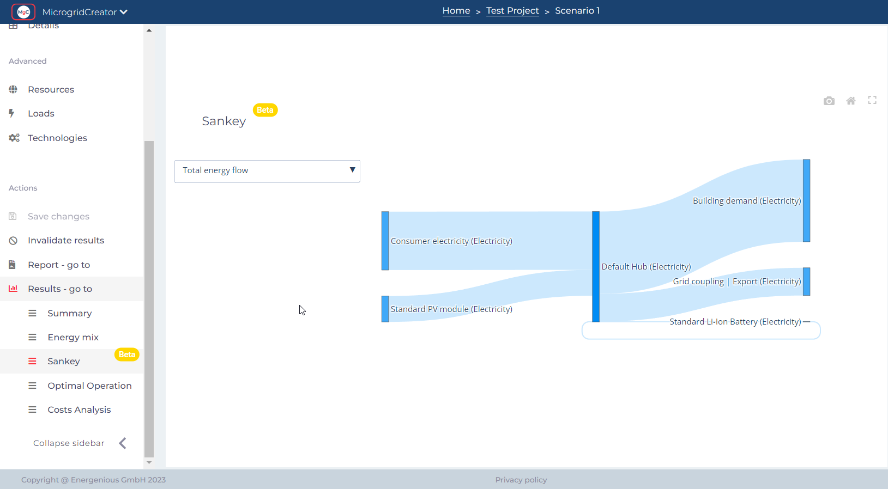

# Project results

**Results summary**

The simulation results in MgC can be accessed and explored by clicking on the **"Results"** section, conveniently located under the **"Action"** feature on the left side of the MgC layout. Here, a comprehensive summary of crucial project details, including [**installed capacities**](../glossary/definitions.md#reference-for-kpi-formulas)**,** [**emissions data**](../glossary/definitions.md#reference-for-kpi-formulas)**,** [**operational timelines**](../glossary/definitions.md#reference-for-kpi-formulas)**, and** [**annualized asset costs**](../glossary/definitions.md#reference-for-kpi-formulas), can be viewed, facilitating a thorough examination of key project insights and outcomes.

<figure><figcaption></figcaption></figure>

**Energy mix**

Access to data on electricity, heat, and cooling demand and generation can be obtained by choosing the **"Energy Mix"** option within the "Results" menu. A comprehensive overview of how these critical energy components are interrelated within the project can be provided, facilitating a deeper understanding of energy dynamics and the optimization of the microgrid system for efficiency and sustainability.

<figure><figcaption></figcaption></figure>

**Sankey diagram**

The MgC provides Sankey diagrams as part of its offerings, showcasing its specialization in visualizing and analyzing the flow of energy, materials, or resources within a system.&#x20;

A **Sankey diagram** is a visual representation used to **display the flow of energy, materials, or resources** within a system. It uses arrows or lines of varying widths to show the quantity and distribution of these resources, making it a useful **tool for assessing efficiency, analyzing complex systems, and visualizing environmental impacts**.

Choose the Sankey diagram in the results section of the MgC and **select the layer** to display resource flows efficiently for better data visualization.

<figure><figcaption></figcaption></figure>

Once the layer is selected, the built-in functions within the MgC automatically visualize the relevant flows based on the simulated data. Here the total energy flow is selected for the explanation purpose.

<figure><figcaption></figcaption></figure>

**Optimal operation**

MgC offers "optimal operation" which involves using the data and visualization provided by the MgC to make informed decisions about how to best operate and manage a microgrid's resources and technologies to meet specific goals or criteria effectively.

Checkout this functionality within the "Optimal Operation" section located under the "Results" category. It offers noteworthy recommendations for optimizing the efficiency of the microgrid's operation.

<figure><figcaption></figcaption></figure>

**Cost analysis**

Cost analysis in the MgC is facilitated, allowing valuable insights into the financial aspects of the microgrid project. Inputting data related to resources, technologies, and operational parameters enables an assessment of capital and operational expenses, determination of cost-effectiveness, and informed decision-making regarding the project's financial sustainability.&#x20;

The MgC offers a detailed cost analysis covering project expenses throughout its lifespan, encompassing both [CAPEX](../glossary/definitions.md#reference-for-kpi-formulas) and [OPEX](../glossary/definitions.md#reference-for-kpi-formulas). This feature can be accessed by clicking on "Cost Analysis" within the "Results" section, providing valuable financial insights for effective project management.

<figure><figcaption></figcaption></figure>
