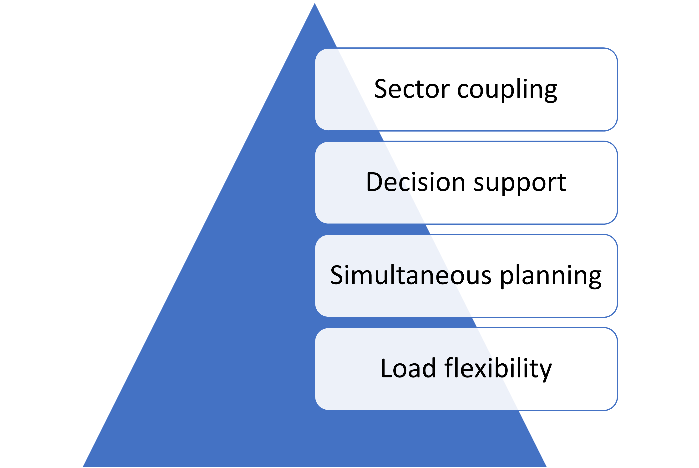

# MgC features

<figure><figcaption>
MgC Features
</figcaption></figure>

1. **Sector coupling**

The growing share of renewable energy sources is changing the entire energy system, which means that an integrative view of all energy sectors is becoming increasingly important. Not only electricity but also the optimized provision of heat and cooling play an important role in an efficient supply system.

With **MgC** you can integrate concepts such as combined heat and power plants, combined heat and power, and electricity-to-gas into your system. The synergy effects resulting from an integrative energy approach represent a significant contribution to increasing the efficiency of your energy system.

2. **Decision support**

Planners and operators of energy systems are often faced with the task of having to meet several key figures, the orientation and goals of which differ. For example,  the most efficient option is not always the cheapest.

With **MgC** you can combine different optimization goals and weigh their importance against each other. For example, you can increase the proportion of renewable energies and at the same time strive to optimize costs. This way, users are ensured to get the best possible system for their needs.

3. **Simultaneous planning of size and operation**

When planning energy systems, it is important to remember that design and operation are interdependent. In this way, operational improvements can ensure that the interaction of certain technologies has a positive influence on the overall costs of the project. On the other hand, there is no point in considering components with low investment costs unless one also examines the physical and economic effects of operation.

With MgC users can optimize technology selection, system design, and operation during the planning phase. At the same time, it is possible to optimize the operation of already existing systems by adding additional components and examining their influence on the goals you are striving for.

4. **Integrate load flexibility**

With the increasing integration of fluctuating renewable energies such as solar and wind power, the proportion of technologies that can be used to balance the differences between demand and generation is decreasing. Newer concepts predict that the user side can contribute to the necessary balance.

With MgC, you can take flexible load and demand management into account when planning and operating your energy system. Several options allow you to examine the effectiveness of the load flexibility concept in terms of system improvement.
