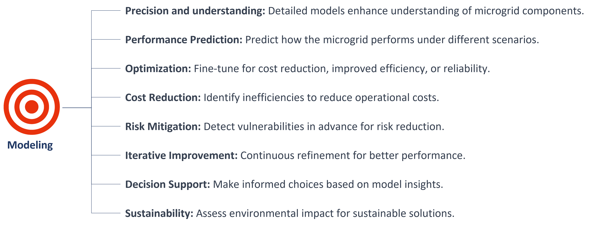

# Modeling

Modeling is crucial for microgrid design and optimization as it allows precise performance prediction, cost reduction, risk mitigation, sustainability assessment, and informed decision-making.

<figure><figcaption>
Modeling needs and benefits
</figcaption></figure>

MgC comprises essential core functionalities for microgrid design and optimization that are;&#x20;

* Model generator&#x20;
* Optimization solver

**Model generator**

1. **Modeling real building blocks:** In MgC, the process of modeling real building blocks involves users defining the core attributes of microgrid components. This is achieved by inputting specific characteristics, such as the capacity of energy sources, efficiency of storage systems, and performance data for loads. The tool uses this detailed information to create a virtual representation of each component.
2. **Assembling a networked system:** Once users have accurately modeled these building blocks, the next step is assembling them into a networked microgrid system. MgC facilitates this by allowing users to connect these virtual components in a way that mirrors their physical interconnections in an actual microgrid. This networked system is then ready for configuration and optimization to ensure it operates efficiently and meets user-defined objectives. The tool's user-friendly interface simplifies the process of creating a comprehensive and interconnected microgrid model.

**Solving engine for optimization**

1. **Model is formulated as an optimization problem:** In MgC, the microgrid model is precisely defined and represented as an optimization problem. This formulation involves translating the characteristics and configurations of the microgrid into mathematical expressions like [MILP](../milp-modeling-and-optimization-models.md), where the goal is to maximize or minimize specific performance criteria. The tool then systematically solves this problem to determine the optimal configuration and operation of the microgrid.
2. **Solved by a separate sophisticated solver:** MgC leverages a powerful and specialized solver to efficiently address the complex optimization problem. This sophisticated solver employs advanced [algorithms](../milp-mathematical-modeling.md) to find the best solutions within the defined parameters. It systematically processes the model to determine the optimal microgrid configuration, ensuring that it meets the user's defined objectives for cost reduction, energy efficiency, or reliability improvement.

<figure><figcaption>
MgC core tool functionalities
</figcaption></figure>

