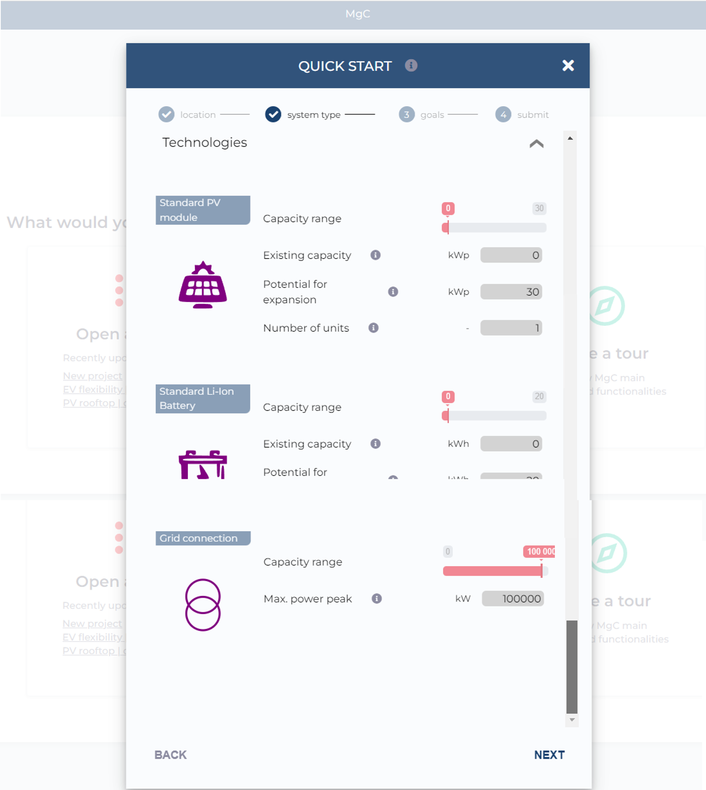

# Creating a project

**Step 1:** To initiate a new project, please click on the **'New Project'** option. In case the project is already established, you can access it by selecting the **'Open a Project'** option available on the MgC interface.

<figure><figcaption></figcaption></figure>

**Step 2:** Following the activation of the 'New Project' function, the subsequent action involves designating the **location for the project** or microgrid by inputting the name of the desired city.

<figure><figcaption></figcaption></figure>

Upon choosing the suitable project location, the MgC captures precise **geographical coordinates**, including longitude and latitude, corresponding to the user's selection.

<figure><figcaption></figcaption></figure>

**Step 3:** Choosing the right project plan is essential. MgC provides different options like Sector Coupling and Rooftop System. To make your selection, simply click on the plan template you prefer in the MgC interface. Follow the energenious website for more updates on the various templates in MgC.&#x20;

<figure><figcaption></figcaption></figure>

**Step 4:** In the system type configuration, the initial setup of system components holds significant importance. To **configure Resources, Loads, and Technologies**, please access the respective settings within the MgC interface by clicking on them individually.

<figure><figcaption></figcaption></figure>

**Step 5:** Within the **Resources settings**, it is imperative to provide the consumer electricity price and the Feed-in tariff to facilitate accurate cost analysis by MgC.

<figure><figcaption></figcaption></figure>

**Step 6:** Loads in microgrids are crucial for balancing electricity supply and demand, ensuring grid stability, optimizing energy usage, and assessing economic viability. To choose the **load facilities**,  provide the peak demand of the load and the number of offices within the Microgrid for accurate configuration.

<figure><figcaption></figcaption></figure>

**Step 7:** MgC provides a range of **energy technologies** to enhance microgrid reliability. User can choose the required technologies by specifying their capacity and the number of units required. Additionally, MgC offers the option to select existing capacity and potential expansion, enabling cost calculations for microgrid operations.

<figure><figcaption></figcaption></figure>

**Step 8:** A notable feature of MgC is its ability to promote environmental consciousness by reducing CO_2 emissions and cutting costs through renewable resource utilization in microgrids. Moving the slider from left to right indicates the choice between saving CAPEX/OPEX or saving CO_2 emissions. This results in the utilization of the most cost-effective resources when the save CAPEX/OPEX option is selected, and the use of renewable resources in the Microgrid to reduce emissions when the save CO_2 emissions option is chosen.&#x20;

<figure><figcaption></figcaption></figure>

**Step 9:** After providing all the inputs, the user is prompted to **enter the project name**. On this page in the MgC interface, users have the flexibility to view the project's location, system type, and goals. Following the project name input, users have two options: **either to Create and Open the project** or to **Create the project and Run the simulation.**

<figure><figcaption></figcaption></figure>

**Step 10:** Following this, the project will be initialized using advanced algorithms within the MgC tool. Once the initialization and simulation are complete, the main interface of MgC will become accessible, providing you with a comprehensive platform for your microgrid initiatives. In this instance, simulation is omitted for explanatory purposes.

<figure><figcaption></figcaption></figure>

After the project has been successfully created, the layout of the MgC will be elaborated upon in the following pages.
