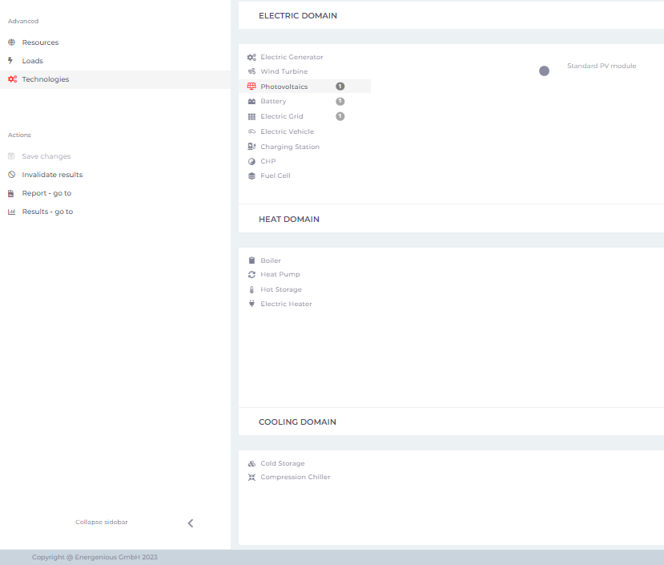

# MgC´s layout

The project simulation, and the MgC layout will be presented below. On the left side of the MgC layout, information regarding the **system design, advanced features, and project-related actions** is displayed for the user reference. Furthermore, project-related assistance can be accessed by users at any time, by clicking the **question mark (?)** button located on the top right side.

<figure><figcaption></figcaption></figure>

**System Design**

**Performance Indicators:** System design performance indicators in the MgC summarize the project's goals, details, description, and penalties, helping users understand its key aspects and expectations.&#x20;

<figure><figcaption></figcaption></figure>

**Network:** For users, the network option in the MgC offers the advantage of simplified communication and coordination among microgrid components, enhancing data exchange and control for improved energy management and system efficiency.&#x20;

This option provides users with the freedom and capability to establish Hubs and branches within the system, enabling them to design and structure their microgrid network according to specific requirements and operational needs.

<figure><figcaption></figcaption></figure>

**Details:** The "Details" section within the system design feature offers users a comprehensive understanding about the **input parameters** of the various domains created within Hubs and branches, showcasing MgC's unique strength in **flexibility across technical, economic, and environmental parameters**. This not only provides guidance but also enriches users with valuable additional insights.

<figure><figcaption></figcaption></figure>

In the "Details" section, input parameters for natural resources, commodities, and financial resources created in the project are displayed, showcasing some of the intriguing features of the MgC.

<figure><figcaption></figcaption></figure>

**Advanced features**

In MgC, a variety of advanced features are offered within the **Resources, Loads, and Technologies** section, allowing users to seamlessly add or access information related to the features they have created, thereby simplifying the process of managing their microgrid project with ease and precision.

In the Resources section, users have the ability to edit the resources of energy to the loads, the commodities such as electricity, natural gas, hydrogen and fuel cells used in the resources, and financial resources like Feed-In tariff, PPA and grants at their discretion, presenting an intriguing feature that allows for precise simulation and enhanced flexibility within the MgC. This data plays a crucial role in ensuring accurate cost analysis and precise simulation capabilities within MgC.

<figure><figcaption></figcaption></figure>


MgC users can also upload the weather data from their own weather database. &#x20;


**Loads**

In a resources feature manner, domains such as **electrical, heating, and cooling loads** are addressed within MgC, enabling users to conveniently manage and access information related to these aspects of their microgrid project.

<figure><figcaption>
#
</figcaption></figure>

**Technologies**

An important feature of MgC is found in its Technologies section, where detailed information about the technologies, equipment, and components in electrical, heating, and cooling domains created within the microgrid project is made available to users, facilitating a comprehensive understanding of the project's technical components.

<figure><figcaption></figcaption></figure>

