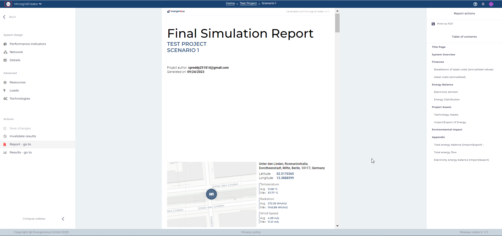

# Save and exporting the project

Following the project's simulation, users can conveniently export project data as a **PDF report** from the action panel situated on the right side of the interface. This report includes essential project details like name, location, and weather data, ensuring comprehensive documentation.

<figure><figcaption></figcaption></figure>

At any time, the possibility to contact support is available to users by clicking on the **question mark(?)** symbol located in the top right corner of the main ribbon, should they encounter any technical issues.
